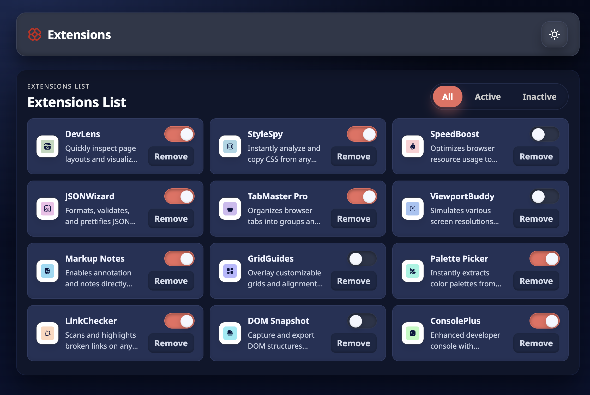

# Browser Extensions Manager UI — Frontend Mentor

Responsive browser extensions dashboard built from the Frontend Mentor challenge. Includes filtering, toggling, removing extensions, and a dark-themed layout that mirrors the provided design.

## Overview

- Dynamic list sourced from `data.json` with toggle and remove controls
- Status filters for all/active/inactive
- Light/dark UI ready (defaulting to dark to match the mock)
- Responsive grid and hover/focus treatments

### Screenshot



### Links

- Solution URL: _TBD_
- Live Site URL: Run locally (see below)

## Getting Started

This is a static build. Serve the files locally to avoid CORS issues when fetching `data.json`.

```bash
npx serve .
# or use any static server (python -m http.server, live-server, etc.)
```

Then open the served `index.html` in your browser.

## My Process

### Built with

- Semantic HTML
- Modern CSS (custom properties, grid/flex)
- Vanilla JavaScript for state + rendering
- Noto Sans font family

### What I learned

- Building a small state store to handle filtering, toggling, and removals without frameworks.
- Using CSS variables to theme light/dark palettes while keeping component styles consistent.
- Balancing grid breakpoints so three columns collapse smoothly on smaller widths.

### Continued development

- Persist active/inactive state to localStorage.
- Add keyboard shortcuts for filter tabs and toggles.
- Publish a live demo via GitHub Pages or Netlify.

### Useful resources

- [MDN Grid Guide](https://developer.mozilla.org/en-US/docs/Web/CSS/CSS_Grid_Layout)
- [MDN Flexbox Guide](https://developer.mozilla.org/en-US/docs/Web/CSS/CSS_Flexible_Box_Layout)

## Author

- Frontend Mentor - [@benoluoch](https://www.frontendmentor.io/profile/benoluoch)
